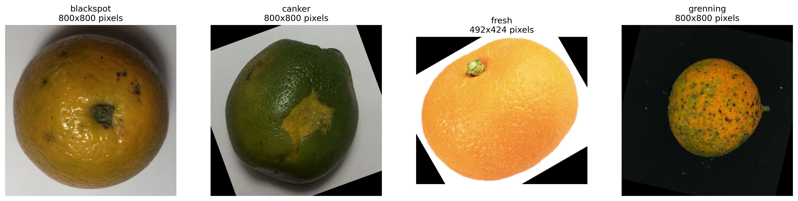
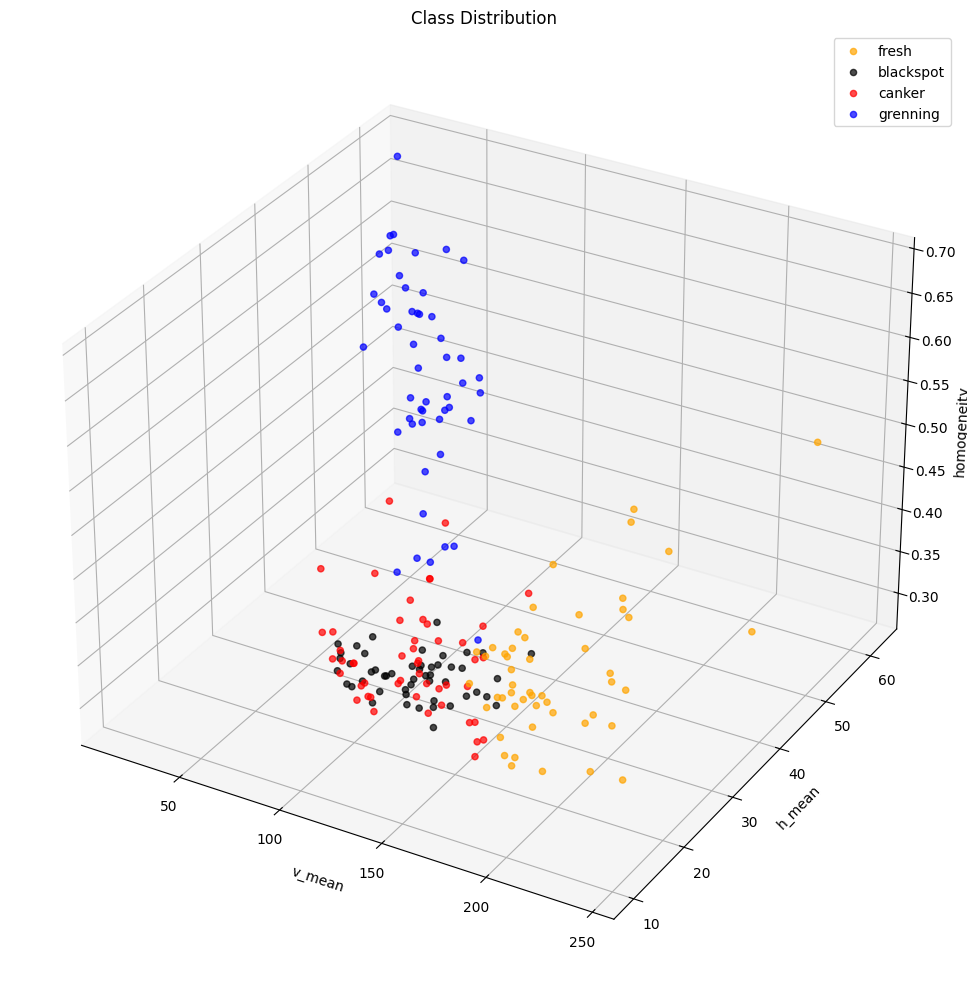
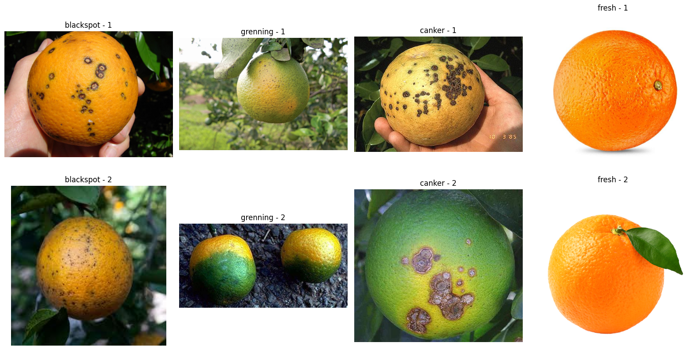
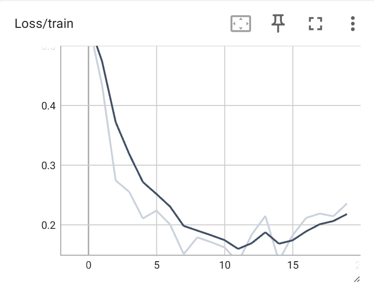
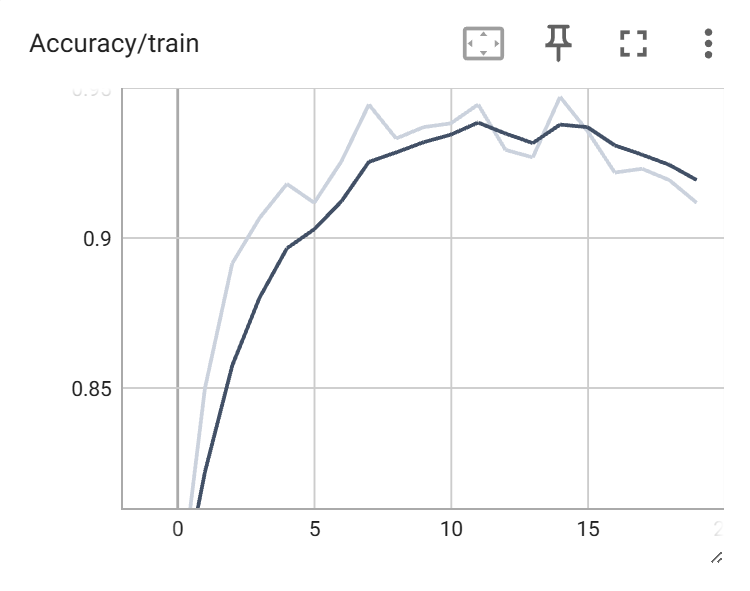
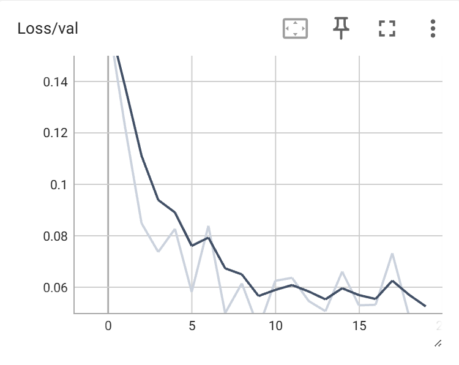
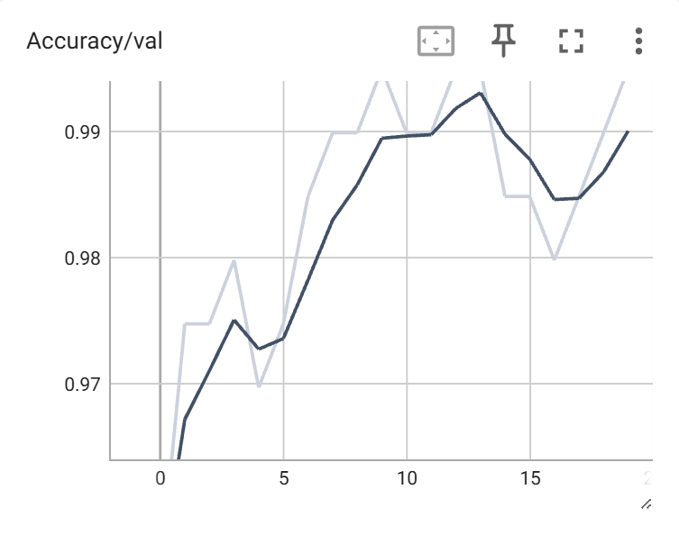
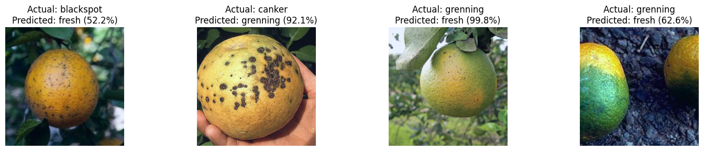

# Ray Tune을 활용한 오렌지 질병 데이터셋 분류 모델 학습 하이퍼 파라미터 튜닝

## 프로젝트 소개
* 딥러닝 기술을 활용하여 오렌지의 질병을 자동으로 탐지하고 분류하는 시스템
* 다양한 이미지 분석 방법론 적용
* EfficientNetV2 모델을 기반으로 한 특징 추출 전이학습
* Ray Tune을 통한 하이퍼파라미터 튜닝

## 프로젝트 기간
* 기간: 2025.03.17(월) ~ 2025.03.30(일)

## 사용 기술 및 모델
* PyTorch
* Ray
* SQLite
* EfficientNetV2-S
 

## 데이터셋
### Kaggle Orange Disease Dataset
- 1,090장의 RGB 이미지로 fresh, blackspot, canker, grenning 4개의 클래스를 가진 데이터셋
- 학습/테스트 데이터셋 비율 9:1

 

### Result of Image Analysis
- 밝기, RGB, HSV, Texture 특성 분석 및 상관관계 분석
- 3D 산점도 분포상 blackspot과 canker의 분류가 명확하지 않음

### Real Test Imageset
- 8장의 RGB 이미지로 fresh, blackspot, canker, grenning 4개의 클래스를 가진 실제 이미지셋

 

## 학습 결과
### 
- 손실함수: CrossEntropyLoss
- 옵티마이저: AdamW
- 스케줄러: CosinAnnealingLR

### Optimized Hyperparameters with Ray Tune
|Learning Rate|Batch Size|Weight Decay|Hidden Dimension|Dropout Ratio|# of Layers|
|:---|:---|:---|:---|:---|:---|
|0.000928194|8|8.95416e-06|1024|0.3|2|

### Result of Test 
- 학습 정확도 94.45%, 검증 정확도 99.49%
- 테스트 정확도 93.94%

<table>
  <tr>
    <td></td>
    <td></td>
  </tr>
  <tr>
    <td></td>
    <td></td>
  </tr>
</table>

### Result of Real Image Test
- 테스트 정확도 50%
- 학습 및 검증단계와 상이한 결과

 
 

## 프로젝트 후기
### Keep
* 데이터셋 선정부터 모델 테스트까지의 전반적인 과정을 논리적으로 이어지게끔 하기 위해 자료를 조사하고 이를 실행했다.
* 비록 목표와 데이터셋이 다르지만 팀원들과 의견을 나누면서 문제 상황을 공유하고 솔루션을 제안하였다.
### Problem
* Colab 리소스를 과다하게 사용하여 막판에 사용량 제한이 걸렸다. 실제 프로젝트라 생각하면 내가 테스트하는 단계에서도 자원을 아껴써야하는 것의 중요함을 느낄 수 있는 계기가 되었다.
* 모델 학습을 마치고 실제 이미지로 테스트했을 때 생각보다 정확도가 낮게(50%) 나왔다.
### Try
* 이미지 분석을 통해 어떤 클래스가 분류가 어려울지 예측 가능하게 하였다.
* 하이퍼파라미터 튜닝에 있어서 Ray Tune을 사용해 최적의 조합을 찾는 시간을 단축시켰다.
* 실제 이미지 또한 학습 데이터셋과 어떤 차이가 있는지 이미지 분석을 진행했다.
